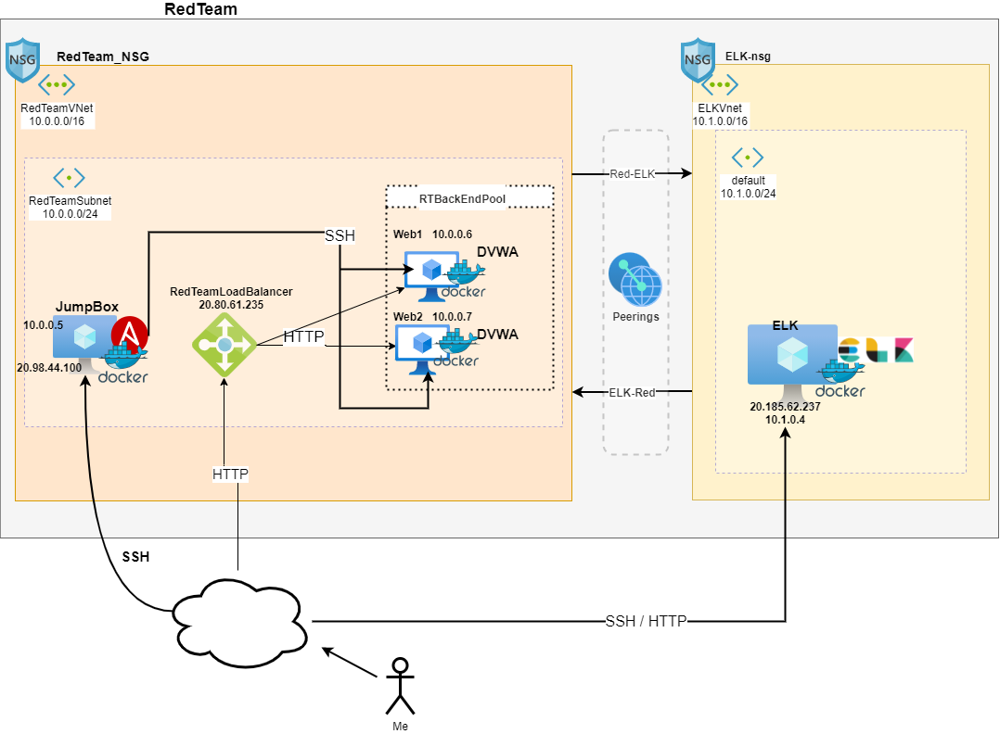
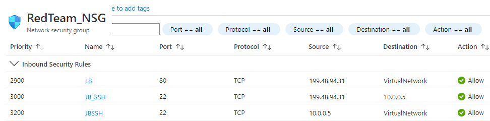
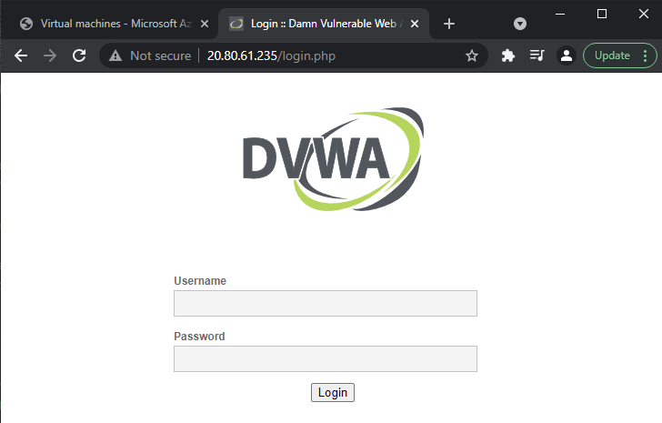
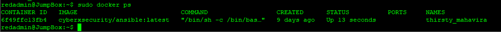
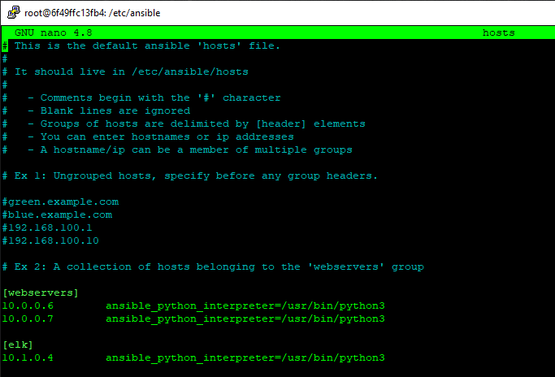
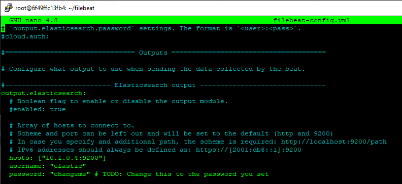
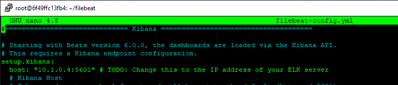
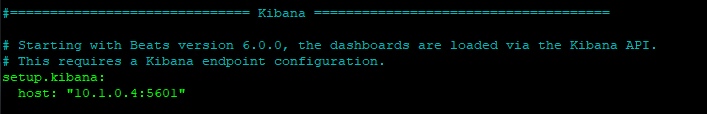
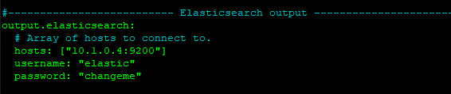

## Automated ELK Stack Deployment

The files in this repository were used to configure the network depicted below.



These files have been tested and used to generate a live ELK deployment on Azure. They can be used to either recreate the entire deployment pictured above, or select portions of the playbook file may be used to install only certain pieces of it, such as Filebeat.

* [install-elk.yml](Ansible/install-elk.yml)

This document contains the following details:

- Description of the Topology
- Access Policies
- ELK Configuration
  - Beats in Use
  - Machines Being Monitored
- How to Use the Ansible Build


### Description of the Topology

The main purpose of this network is to expose a load-balanced and monitored instance of DVWA, the D*mn Vulnerable Web Application.

Load balancing ensures that the application will be highly available. In addition to having the JumpBox controlling access to the internal network.

Integrating an ELK server allows users to easily monitor the vulnerable VMs for changes to the system confgiuration (forwarding monitored logs to ELK) and system performance metrics.

The configuration details of each machine may be found in the table below.

| Name    | Function   | IP@                       | OS    |
|---------|------------|---------------------------|-------|
| JumpBox | Gateway    | 20.98.44.100<br>10.0.0.5  | Linux |
| Web1    | DVWA       | 20.80.61.235<br>10.0.0.6  | Linux |
| Web2    | DVWA       | 20.80.61.235<br>10.0.0.7  | Linux |
| ELK     | ELK  Stack | 20.185.62.237<br>10.1.0.4 | Linux |

### Access Policies

The machines on the internal network are not exposed to the public Internet. 

Only the `JumpBox` machine is configured to accept connections from the Internet over SSH (via a public/private keypair). Access to this machine is only allowed from the following IP addresses:

* `199.48.94.31`



The `LB` inbound rule allows the *Web1* and *Web2* machines to be reachable over HTTP to the load balancer address of `20.80.61.235` from my IP address of `199.48.94.31`.



Machines within the network can only be accessed from within the Ansible container on the JumpBox via SSH. Authenication is by a public/private keypair that is **different** from the keypair used to SSH into the JumpBox.

A summary of the access policies in place can be found in the table below.

| System<br>Name | Publicly<br>Accessible | Allowed<br>Addresses     | Notes                                              |
|----------------|------------------------|--------------------------|----------------------------------------------------|
| JumpBox        | Yes (SSH)              | 199.48.94.31             | Ansible container here                             |
| Web1           | Yes (HTTP)             | 199.48.94.31<br>10.0.0.5 | SSH allowed from ansible <br>container on JumpBox  |
| Web2           | Yes (HTTP)             | 199.48.94.31<br>10.0.0.5 | SSH allowed from ansible <br>container on JumpBox  |
| ELK            | Yes (HTTP & SSH)       | 199.48.94.31<br>10.0.0.5 | SSH allowed from ansible <br>container on JumpBox  |

### Elk Configuration

Ansible was used to automate configuration of the ELK machine. No configuration was performed manually, which is advantageous because...

- Significantly less error prone: plays are executed as written with no operator deviations or second guessing.
- Readily and easily extenbile by adding new playbooks, new plays in an existing playbook, or modifying the applicable systems in the `/etc/ansible/hosts` file.

The playbook implements the following tasks:

- Increase the VM's max memory mapped parameter (ELK uses a lot of memory).
- Install (*apt*) `docker` and `pip3` packages
- Install (*pip*) `docker` python package
- Pull the ELK container and configure (e.g. exposed/published ports)
- Enable docker service to start when the VM is restarted.

The screenshot below displays the result of running `docker ps` after successfully configuring the ELK instance.



### Target Machines & Beats
This ELK server is configured to monitor the following machines:

* Web1    10.0.0.6
* Web2    10.0.0.7

We have installed the following Beats on these machines:

- FileBeats
- MetricBeats  

These Beats allow us to collect the following information from each machine:

FileBeats - send system logs and monitor changes to important files.

MetricBeats - system performance metrics (e.g. system) to help identify trends, capacity plan, be altered that something is using more resources than *reasonable*.


### Using the Playbook
In order to use the playbook, you will need to have an Ansible control node already configured. Assuming you have such a control node provisioned: 

SSH into the control node and follow the steps below:

- Copy the playbook and configuration files to your ansible playbook destination. (e.g. `/etc/ansible`).  I don't like to litter the filesystem so I kept my in root's home directory. 

```bash
root@6f49ffc13fb4:~# ls -R
.:
filebeat  install-elk.yml  metricbeat  web.yml

./filebeat:
filebeat-config.yml  filebeat-playbook.yml

./metricbeat:
metricbeat-playbook.yml  metricbeat.yml
```

- Update the `/etc/ansible/hosts` file to specify which systems are webservers (where DVWA and the beats are installed) and where the ELK stack should be deployed.
For example:



Edit the `filebeat-config.yml` and `metricbeat.yml` files to reflect the particulars of your setup. Oh, if you're going to do this in production, don't use the default credentials.

*filebeat config*




*metricbeat config*



- Run the playbooks, and navigate to `http://[IP_address]:5601/app/kibana#/home` to check that the installation worked as expected. (e.g. `http://20.185.62.237:5601/app/kibana#/home`)