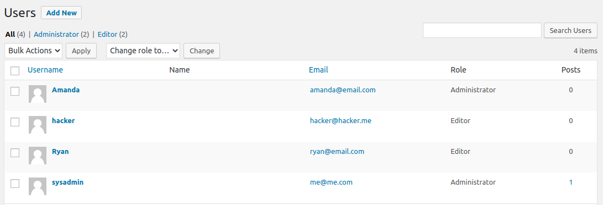
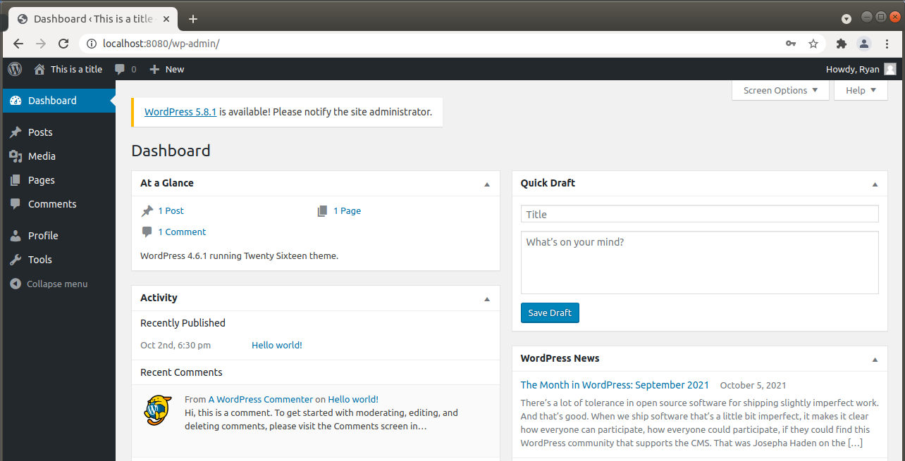
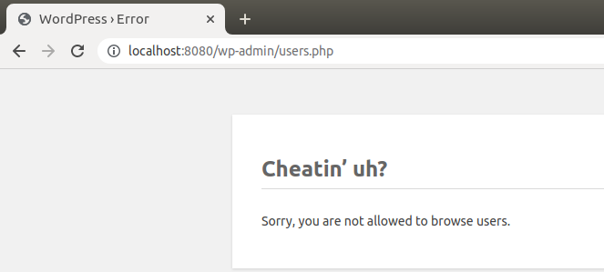

## Week 14 Homework: Web Development

### Questions 

#### HTTP Requests and Responses

Answer the following questions about the HTTP request and response process.

1. What type of architecture does the HTTP request and response process occur in?  

* Client and Server

2. What are the different parts of an HTTP request? 

* Request line
* Headers
* Request Body

3. Which part of an HTTP request is optional?

* Request Body

4. What are the three parts of an HTTP response?

* Status line
* Headers
* Response body

5. Which number class of status codes represents errors?

* 4xx - user errors
* 5xx - server errors

6. What are the two most common request methods that a security professional will encounter? 

* GET
* POST

7. Which type of HTTP request method is used for sending data?

* POST

8. Which part of an HTTP request contains the data being sent to the server?

* Request body

9. In which part of an HTTP response does the browser receive the web code to generate and style a web page?

* Response body

#### Using curl

Answer the following questions about `curl`:

10. What are the advantages of using `curl` over the browser?

There is no grpahical component so it's lightweight for servers and can be scripted.

11. Which `curl` option is used to change the request method?

* `-X` or `--request`

12. Which `curl` option is used to set request headers?

* `-H` or `--header` followed by the header to be set

13. Which `curl` option is used to view the response header?

* `-I` or `--head`

14. Which request method might an attacker use to figure out which HTTP requests an HTTP server will accept?

* OPTIONS

#### Sessions and Cookies

Recall that HTTP servers need to be able to recognize clients from one another. They do this through sessions and cookies.

Answer the following questions about sessions and cookies:

15. Which response header sends a cookie to the client?

    ```HTTP
    HTTP/1.1 200 OK
    Content-type: text/html
    Set-Cookie: cart=Bob
    ```
* Set-Cookie

16. Which request header will continue the client's session?

    ```HTTP
    GET /cart HTTP/1.1
    Host: www.example.org
    Cookie: cart=Bob
    ```
* Cookie (specifying the session)

#### Example HTTP Requests and Responses

Look through the following example HTTP request and response and answer the following questions:

**HTTP Request**

```HTTP
POST /login.php HTTP/1.1
Host: example.com
Accept-Encoding: gzip, deflate, br
Connection: keep-alive
Content-Type: application/x-www-form-urlencoded
Content-Length: 34
Upgrade-Insecure-Requests: 1
User-Agent: Mozilla/5.0 (Linux; Android 6.0; Nexus 5 Build/MRA58N) AppleWebKit/537.36 (KHTML, like Gecko) Chrome/80.0.3987.132 Mobile Safari/537.36

username=Barbara&password=password
```

17. What is the request method?

* POST

18. Which header expresses the client's preference for an encrypted response?

* Upgrade-Insecure-Requests

19. Does the request have a user session associated with it?

* No

20. What kind of data is being sent from this request body?

* login information (username and password)

**HTTP Response**

```HTTP
HTTP/1.1 200 OK
Date: Mon, 16 Mar 2020 17:05:43 GMT
Last-Modified: Sat, 01 Feb 2020 00:00:00 GMT
Content-Encoding: gzip
Expires: Fri, 01 May 2020 00:00:00 GMT
Server: Apache
Set-Cookie: SessionID=5
Content-Type: text/html; charset=UTF-8
Strict-Transport-Security: max-age=31536000; includeSubDomains
X-Content-Type: NoSniff
X-Frame-Options: DENY
X-XSS-Protection: 1; mode=block

[page content]
```

21. What is the response status code?

* 200 OK

22. What web server is handling this HTTP response?

* Apache

23. Does this response have a user session associated to it?

* Yes, a cookie `SessionID` is being set (to 5 in the above response)

24. What kind of content is likely to be in the [page content] response body?

* HTML text for a web page.

25. If your class covered security headers, what security request headers have been included?

```
Strict-Transport-Security: max-age=31536000; includeSubDomains
X-Content-Type: NoSniff
X-Frame-Options: DENY
X-XSS-Protection: 1; mode=block
```

#### Monoliths and Microservices

Answer the following questions about monoliths and microservices:

26. What are the individual components of microservices called?

Services ... the smallest independent part of the business logic. 

27. What is a service that writes to a database and communicates to other services?

API service

28. What type of underlying technology allows for microservices to become scalable and have redundancy?

* containers

#### Deploying and Testing a Container Set

Answer the following questions about multi-container deployment:

29. What tool can be used to deploy multiple containers at once?

`docker-compose`

30. What kind of file format is required for us to deploy a container set?

YAML `.yml` file extension

#### Databases

31. Which type of SQL query would we use to see all of the information within a table called `customers`?

* `SELECT * FROM customers`

32. Which type of SQL query would we use to enter new data into a table? (You don't need a full query, just the first part of the statement.)

* `INSERT INTO <table> <values>`

33. Why would we never run `DELETE FROM <table-name>;` by itself?

Without a `WHERE` clause to specify records, the entire table is deleted. 

---

### Bonus Challenge Instructions: The Cookie Jar

First, using Docker Compose, navigate to the Day 1 WordPress activity directory and bring up the container set:

- `/home/sysadmin/Documents/docker_files`

Using `curl`, you will do the following for the Ryan user:

  - Log into WordPress and save the user's cookies to a cookie jar.

  - Test a WordPress page by using a cookie from the cookie jar.

  - Pipe the output from the cookie with `grep` to check for authenticated page access.

  - Attempt to access a privileged WordPress admin page.

#### Step 1: Set Up

Create two new users: Amanda and Ryan.   

1. Navigate to `localhost:8080/wp-admin/`

2. On the left-hand toolbar, hover over **Users** and click **Add New**.

3. Enter the following information to create the new user named Amanda.

    - Username: `Amanda`
    - Email: `amanda@email.com`

4. Skip down to password:

    - Password: `password`
    - Confirm Password: Check the box to confirm use of weak password.
    - Role: `Administrator`

5. Create another user named Ryan.

    - Username: `Ryan`
    - Email: `ryan@email.com`

6. Skip down to password:

    - Password: `123456`
    - Confirm Password: Check the box to confirm use of weak password.
    - Role: `Editor`

7. Log out and log in with the following credentials:

    - Username: `Amanda`
    - Password: `password`

#### Step 2: Baselining

For these "baselining" steps, you'll want to log into two different types of accounts to see how the WordPress site looks at the `localhost:8080/wp-admin/users.php` page.  We want to see how the Users page looks from the perspective of an administrator, vs. a regular user.

1. Using your browser, log into your WordPress site as your sysadmin account and navigate to `localhost:8080/wp-admin/users.php`, where we previously created the user Ryan. Examine this page briefly. Log out.



2. Using your browser, log into your Ryan account and attempt to navigate to `localhost:8080/wp-admin/index.php`. Note the wording on your Dashboard.



3. Attempt to navigate to `localhost:8080/wp-admin/users.php`. Note what you see now.



Log out in the browser.

#### Step 3: Using Forms and a Cookie Jar

Navigate to `~/Documents` in a terminal to save your cookies.

1. Construct a `curl` request that enters two forms: `"log={username}"` and `"pwd={password}"` and goes to `http://localhost:8080/wp-login.php`. Enter Ryan's credentials where there are placeholders.


    - **Question:** Did you see any obvious confirmation of a login? (Y/N)   Y

2. Construct the same `curl` request, but this time add the option and path to save your cookie: `--cookie-jar ./ryancookies.txt`. This option tells `curl` to save the cookies to the `ryancookies.txt` text file.


3. Read the contents of the `ryancookies.txt` file.


   - **Question:** How many items exist in this file?  `There are 5 cookies.`

Note that each one of these is a cookie that was granted to Ryan after logging in.

#### Step 4: Log in Using Cookies

1. Craft a new `curl` command that now uses the `--cookie` option, followed by the path to your cookies file. For the URL, use `http://localhost:8080/wp-admin/index.php`.

`curl -v -L http://localhost:8080/wp-admin/index.php --cookie ./ryancookies.txt`

   - **Question:** Is it obvious that we can access the Dashboard? (Y/N)  Y


2. Press the up arrow on your keyboard to run the same command, but this time, pipe `| grep Dashboard` to the end of your command to return all instances of the word `Dashboard` on the page.

`curl -v -L http://localhost:8080/wp-admin/index.php --cookie ./ryancookies.txt | grep Dashboard`

    - **Question:**  Look through the output where `Dashboard` is highlighted. Does any of the wording on this page seem familiar? (Y/N) If so, you should be successfully logged in to your Editor's dashboard.   Y

    

#### Step 5: Test the Users.php Page

1. Finally, write a `curl` command using the same `--cookie ryancookies.txt` option, but attempt to access `http://localhost:8080/wp-admin/users.php`.

`curl -v -L http://localhost:8080/wp-admin/users.php --cookie ./ryancookies.txt`

    - **Question:** What happens this time?
It errors as before (with a message that we are not able to look at users.)


---

### Submission Guidelines

* Save the file where you documented your solutions and submit it as your homework deliverable. 

---
© 2020 Trilogy Education Services, a 2U, Inc. brand. All Rights Reserved.  
