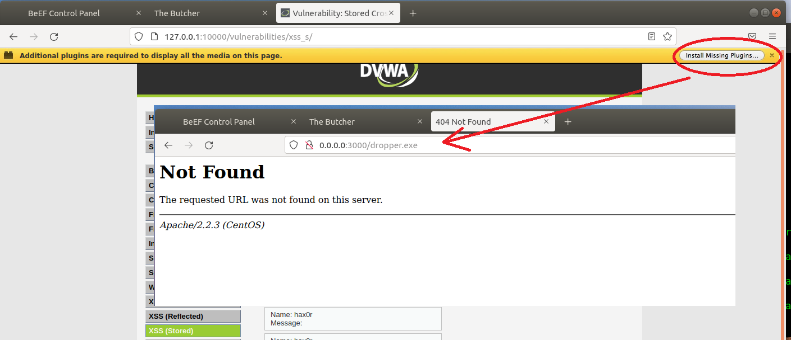

# Unit 15 Homework

---

## Web Application 1: *Your Wish is My Command Injection*

Now that you have determined that Replicants new application is vulnerable to command injection, you are tasked with using the dot-dot-slash method to design two payloads that will display the contents of the following files:
   
   - `/etc/passwd`
   
   - `/etc/hosts`
  
   **Hint:** Try testing out a command directly on the command line to help design your payload.

**Deliverable**: Take a screen shot confirming that this exploit was successfully executed and provide 2-3 sentences outlining mitigation strategies. 

**Mitigation:**  Sanitize user input. Limit the input to 15 characters and only accept something that resembles an IPv4 address. 

## Web Application 2: *A Brute Force to Be Reckoned With*

Years ago, Replicants had a systems breach and several administrators passwords were stolen by a malicious hacker. The malicious hacker was only able to capture a list of passwords, not the associated accounts' usernames. Your manager is concerned that one of the administrators that accesses this new web application is using one of these compromised passwords. Therefore, there is a risk that the malicious hacker can use these passwords to access an administrator's account and view confidential data.

   - Use the web application tool **Burp Suite**, specifically the **Burp Suite Intruder** feature, to determine if any of the administrator accounts are vulnerable to a brute force attack on this web application. 

   - You've been provided with a list of administrators and the breached passwords:

     - List of Administrators
     - Breached list of Passwords

**Deliverable**: Take a screen shot confirming that this exploit was successfully executed and provide 2-3 sentences outlining mitigation strategies.

**Mitigation:**  Recognize and slow down repeated signon attempts from the same IP (regardless if it's for the same user or not).  Add a captcha between login attempts. If not already in use, consider adding key lengthening (e.g. PBKDF2) or increasing the iteration count. While not strictly an anti-brute force measure, it'll take a little longer on the server to validate each login attempt. After a certain threshold, refuse to accept additional attempts from the same IP (e.g. fail2ban).

### Web Application 3: *Where's the BeEF?*

Now that you know how to use the BeEF tool, you'll use it to test the Replicants web application. You are tasked with using a stored XSS attack to inject a BeEF hook into Replicants' main website.

   - Task details:
     - The page you will test is the Replicants Stored XSS application which was used the first day of this unit: `http://192.168.13.25/vulnerabilities/xss_s/`
     - The BeEF hook, which was returned after running the `sudo beef` command was: `http://127.0.0.1:3000/hook.js`
     - The payload to inject with this BeEF hook is: ``

   -  When you attempt to inject this payload,  you will encounter a client-side limitation that will not allow you to enter the whole payload. You will need to find away around this limitation.    
      
      - **Hint:** Try right-clicking and selecting "Inspecting the Element".
    
   - Once you are able to hook into Replicants website, attempt a couple BeEF exploits. Some that work well include:
     
     - Social Engineering >> Pretty Theft
     
     
     - Social Engineering >> Fake Notification Bar
    

     - Host >> Get Geolocation (Third Party)
      
    `Redacted some detail.`

**Deliverable**: Take a screen shot confirming that this exploit was successfully executed and provide 2-3 sentences outlining mitigation strategies.

**Mitigation:**  Sanitize user input. Limit which HTML tags are permitted (if any).  The HTML code for the textarea: 
`<textarea name="mtxMessage" cols="50" rows="3" maxlength="50"></textarea>` 

intends to limit the input to 50 characters over 3 lines (rows). With the Inspect Element option, the length was increased to accomodate the XSS payload.  Another migitation option is to truncate strings to 50 characters.

---

© 2021 Trilogy Education Services, a 2U, Inc. brand. All Rights Reserved.
