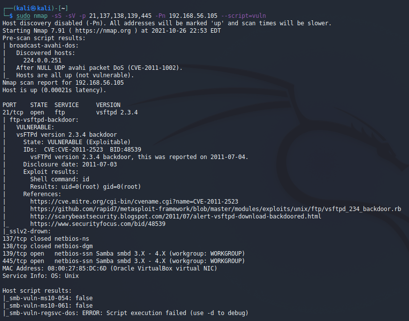

## Week 16 Homework Submission File: Penetration Testing 1

#### Step 1: Google Dorking


- Using Google, can you identify who the Chief Executive Officer of Altoro Mutual is:
`Karl Fitzgerald`


- How can this information be helpful to an attacker:

1. As CEO, Karl's access to corporate information would make him a prime target for a spear phising or whaling campaign.
2. Impersonate CEO as part of a business email compromise in an attempt to have funds transferred for an *important acquisition*.

#### Step 2: DNS and Domain Discovery

Enter the IP address for `demo.testfire.net` into Domain Dossier and answer the following questions based on the results:
```
$ ping demo.testfire.net

Pinging demo.testfire.net [65.61.137.117] with 32 bytes of data:
Reply from 65.61.137.117: bytes=32 time=37ms TTL=115
```
  1. Where is the company located: 
```
Registrant City: Sunnyvale
Registrant State/Province: CA
Registrant Postal Code: 94085
Registrant Country: US
```

  2. What is the NetRange IP address:

```
  NetRange:       65.61.137.64 - 65.61.137.127
  CIDR:           65.61.137.64/26
```

  3. What is the company they use to store their infrastructure:
`Rackspace Backbone Engineering`

  4. What is the IP address of the DNS server:

| DNS              | IP@            |
|------------------|----------------|
| asia3.akam.net   | 23.211.61.64   |
| eur2.akam.net    | 95.100.173.64  |
| eur5.akam.net    | 23.74.25.64    |
| ns1-206.akam.net | 193.108.91.206 |
| ns1-99.akam.net  | 193.108.91.99  |
| usc2.akam.net    | 184.26.160.64  |
| usc3.akam.net    | 96.7.50.64     |
| usw2.akam.net    | 184.26.161.64  |

#### Step 3: Shodan

- What open ports and running services did Shodan find:

`80, 443, and 8080 `

#### Step 4: Recon-ng

- Install the Recon module `xssed`. 
- Set the source to `demo.testfire.net`. 
- Run the module. 

Is Altoro Mutual vulnerable to XSS: 


Manually searched `xssed.com` and found 1 result  `http://xssed.com/mirror/57864/`


### Step 5: Zenmap

Your client has asked that you help identify any vulnerabilities with their file-sharing server. Using the Metasploitable machine to act as your client's server, complete the following:

- Command for Zenmap to run a service scan against the Metasploitable machine: 
 `sudo nmap -sS -sV -p 21,137,138,139,445 -Pn 192.168.56.105`  (scanning for FTP and SMB)


- Bonus command to output results into a new text file named `zenmapscan.txt`:
Append `-oN zenmapscan.txt` to the above command

- Zenmap vulnerability script command:  
`sudo nmap -sS -sV -p 21,137,138,139,445 -Pn 192.168.56.105 --script=vuln`


- Once you have identified this vulnerability, answer the following questions for your client:
  1. What is the vulnerability:
    `ftp-vsftpd-backdoor  CVE-2011-2523`
    `vsftpd 2.3.4 downloaded between 20110630 and 20110703 contains a backdoor which opens a shell on port 6200/tcp.`
  2. Why is it dangerous:
    `Allows for someone to log in (without authentication) as root.`  

  3. What mitigation strategies can you recommendations for the client to protect their server:
    + Upgrade to a more current vsftpd version. 
    + Monitor / block activity on port 6200/tcp.

---
© 2020 Trilogy Education Services, a 2U, Inc. brand. All Rights Reserved.  

