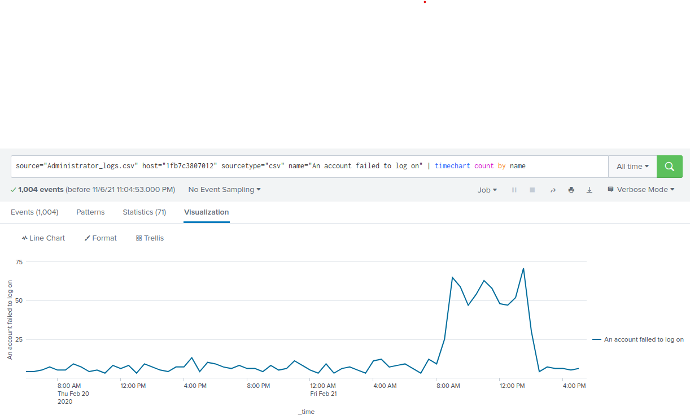

# The Need for Speed

Created a Calculated Field as I disliked `eval's` lack of persistence.

`Settings > Fields > (Calculated Fields) +Add new >`


Create a report using the Splunk's table command to display the following fields in a statistics report:

* _time
* IP_ADDRESS
* DOWNLOAD_MEGABITS
* UPLOAD_MEGABITS
* ratio

`source="server_speedtest.csv" | sort _time IP_ADDRESS | table _time IP_ADDRESS UPLOAD_MEGABITS DOWNLOAD_MEGABITS ratio`

#### Reports
* [speedtest](speedtest.pdf)
* [198.153.194.1.speed](198.153.194.1.speed.pdf)
* [198.153.194.2.speed](198.153.194.2.speed.pdf)

Based on the report created, what is the approximate date and time of the attack?
How long did it take your systems to recover?

``` bash
198.153.194.1 2020-02-22 14:30:00  ->  2020-02-23 23:30:00      33 hours
198.153.194.2 2020-02-22 23:30:00  ->  2020-02-23 23:30:00      24 hours
```

# Are We Vulnerable?
Create a report that shows the count of critical vulnerabilities from the customer database server (IP is `10.11.36.23`).
Build an alert that monitors every day to see if this server has any critical vulnerabilities. If a vulnerability exists, have an alert emailed to `soc@vandalay.com`.

`source="nessus_logs.csv" dest_ip="10.11.36.23" severity="critical"  | stats count as total`


# Drawing the (base)line

 Analyze administrator logs that document a brute force attack. Then, create a baseline of the ordinary amount of administrator bad logins and determine a threshold to indicate if a brute force attack is occurring.

`source="Administrator_logs.csv" host="1fb7c3807012" sourcetype="csv" name="An account failed to log on" | timechart count by name`


When did the brute force attack occur?
`February 21, 2020 @ 0800`

Determine a baseline of normal activity and an alert threshold. Design an alert to check the threshold every hour and email the SOC team at `SOC@vandalay.com` if triggered.

Based on previous activity, 15 bad logins is where I'd set the alert threshold.
