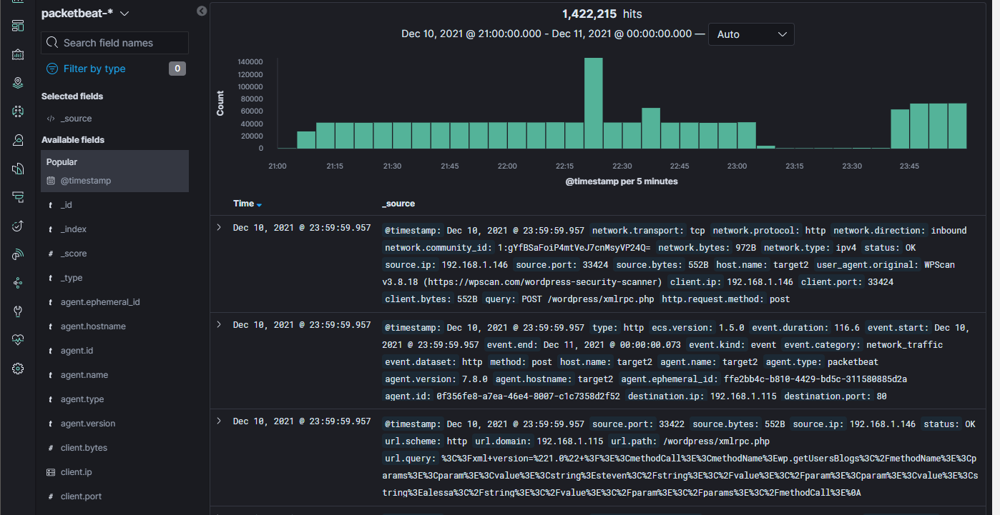

# Blue Team: Summary of Operations

## Table of Contents
- Network Topology
- Description of Targets
- Monitoring the Targets
- Patterns of Traffic & Behavior
- Suggestions for Going Further

### Network Topology

The following machines were identified on the network:
- ELK
  - **Operating System**: `Linux` 
  - **Purpose**:          `Alert collection and Kibana dashboard`
  - **IP Address**:       `192.168.1.100`
- Capstone
  - **Operating System**: `Linux` 
  - **Purpose**:          `Alert testing`
  - **IP Address**:       `192.168.1.105`
- Kali
  - **Operating System**: `Linux`
  - **Purpose**:          `Pen test / attacking machine`
  - **IP Address**:       `192.168.1.146`
- Target 1
  - **Operating System**: `Linux`
  - **Purpose**:          `1st attack target`
  - **IP Address**:       `192.168.1.110`
- Target 2
  - **Operating System**: `Linux`
  - **Purpose**:          `2nd attack target`
  - **IP Address**:       `192.168.1.115`  

### Description of Targets

The target of this attack was `Target 1` at IP address `192.168.1.110`.

Target 1 is an Apache web server and has SSH enabled, so ports 80 and 22 are possible ports of entry for attackers. As such, the following alerts have been implemented:

### Monitoring the Targets

Traffic to these services should be carefully monitored. To this end, we have implemented the alerts below:

#### HTTP Request Size Monitor

The alert is implemented as follows:
  - **Metric**: Sum of HTTP request bytes for one minute intervals.
  `WHEN sum() of http.request.bytes OVER all documents IS ABOVE 3500 FOR THE LAST 1 minute`
  - **Threshold**: 3500
  - **Vulnerability Mitigated**:  Large traffic spikes could be indicative of scanning, brute force attempts, or denial of service.
  - **Reliability**: This alert turned out pretty interesting. Instances of the watch firing could be correlated back to `wpscan` of the wordpress site.
Correlating watch name to internal id.


Example timeframe of this watch firing (i.e. condition met).


Activity of `wpscan` being ran against wordpress site.


#### CPU utilization
Alert 2 is implemented as follows:
  - **Metric**: CPU data collected from metricbeat.
  - **Threshold**: `WHEN max() OF system.process.cpu.total.pct OVER all documents IS ABOVE 0.5 FOR THE LAST 5 minutes`
  - **Vulnerability Mitigated**: Availability / DoS. CPU is busy and may not able to handle additional work. Could be an indicator that malware (e.g. crypto mining) is running.
  - **Reliability**: All it tells us is that CPU has been > 50% for the last 5 minutes with no indication of why. Further performance analysis would be required.

#### SSH Login Failures
Alert 3 is implemented as follows:
  - **Metric**:  system.auth.ssh.event data collected by filebeat.
  - **Threshold**:  10 failed attempts
  - **Vulnerability Mitigated**: Brute force access via SSH.
  - **Reliability**: As written, the search window was not relative (e.g. the last 15 minutes) and caught failed login attempt long after they occurred. Further refinement is needed.

```json
{
  "trigger": {
    "schedule": {
      "interval": "1m"
    }
  },
  "input": {
    "search": {
      "request": {
        "search_type": "query_then_fetch",
        "indices": [
          "filebeat-*"
        ],
        "rest_total_hits_as_int": true,
        "body": {
          "size": 0,
          "query": {
            "match": {
              "system.auth.ssh.event": "Failed"
            }
          }
        }
      }
    }
  },
  "condition": {
    "compare": {
      "ctx.payload.hits.total": {
        "gte": 10
      }
    }
  },
  "actions": {
    "my-logging-action": {
      "logging": {
        "level": "info",
        "text": "There are {{ctx.payload.hits.total}} documents in your index. Threshold is 10."
      }
    }
  }
}
```

### Suggestions for Going Further (Optional)

The logs and alerts generated during the assessment suggest that this network is susceptible to several active threats, identified by the alerts above. In addition to watching for occurrences of such threats, the network should be hardened against them. The Blue Team suggests that IT implement the fixes below to protect the network:
- Vulnerability 1
  - **Patch**: Implement `fail2bain` or some other agent to monitor and react to excessive login / bruteforce attempts.
  - **Why It Works**:  Attempts are blocked before they become extreme.
- Vulnerability 2
  - **Patch**: Disable XMPLRPC on the wordpress site.
  - **Why It Works**: Wordpress now uses REST API so XMLRPC is no longer needed. It can be abused to enumerate users, implement Distributed denial-of-service (DDoS) attacks, or alter site content (once credentials are obtained).

