# Red Team: Summary of Operations

## Table of Contents
- Exposed Services
- Critical Vulnerabilities
- Exploitation

### Exposed Services for Target 1

Nmap scan results for each machine reveal the below services and OS details:

```bash
$ sudo nmap -sS -sV -Pn -n -p1- -O -oA tgt1 192.168.1.110
[sudo] password for kali: 
Host discovery disabled (-Pn). All addresses will be marked 'up' and scan times will be slower.
Starting Nmap 7.91 ( https://nmap.org ) at 2021-12-09 22:38 EST
Nmap scan report for 192.168.1.110
Host is up (0.00019s latency).
Not shown: 65529 closed ports
PORT      STATE SERVICE     VERSION
22/tcp    open  ssh         OpenSSH 6.7p1 Debian 5+deb8u8 (protocol 2.0)
80/tcp    open  http        Apache httpd 2.4.10 ((Debian))
111/tcp   open  rpcbind     2-4 (RPC #100000)
139/tcp   open  netbios-ssn Samba smbd 3.X - 4.X (workgroup: WORKGROUP)
445/tcp   open  netbios-ssn Samba smbd 3.X - 4.X (workgroup: WORKGROUP)
55205/tcp open  status      1 (RPC #100024)
MAC Address: 08:00:27:8F:EF:72 (Oracle VirtualBox virtual NIC)
Device type: general purpose
Running: Linux 3.X|4.X
OS CPE: cpe:/o:linux:linux_kernel:3 cpe:/o:linux:linux_kernel:4
OS details: Linux 3.2 - 4.9
Network Distance: 1 hop
Service Info: Host: TARGET1; OS: Linux; CPE: cpe:/o:linux:linux_kernel

OS and Service detection performed. Please report any incorrect results at https://nmap.org/submit/ .
Nmap done: 1 IP address (1 host up) scanned in 14.78 seconds
```

Scanning the website at  `http://192.168.1.110/` 

```bash
==> DIRECTORY: http://192.168.1.110/vendor/                                                                                        
==> DIRECTORY: http://192.168.1.110/wordpress/ 

---- Entering directory: http://192.168.1.110/vendor/ ----
(!) WARNING: Directory IS LISTABLE. No need to scan it.                        
    (Use mode '-w' if you want to scan it anyway)
                                                                                                                                   
---- Entering directory: http://192.168.1.110/wordpress/ ----
+ http://192.168.1.110/wordpress/index.php (CODE:301|SIZE:0)                                                                       
==> DIRECTORY: http://192.168.1.110/wordpress/wp-admin/                                                                            
==> DIRECTORY: http://192.168.1.110/wordpress/wp-content/                                                                          
==> DIRECTORY: http://192.168.1.110/wordpress/wp-includes/                                                                         
+ http://192.168.1.110/wordpress/xmlrpc.php (CODE:405|SIZE:42)         

---- Entering directory: http://192.168.1.110/wordpress/wp-content/ ----
+ http://192.168.1.110/wordpress/wp-content/index.php (CODE:200|SIZE:0)                                                            
==> DIRECTORY: http://192.168.1.110/wordpress/wp-content/languages/                                                                
==> DIRECTORY: http://192.168.1.110/wordpress/wp-content/plugins/                                                                  
==> DIRECTORY: http://192.168.1.110/wordpress/wp-content/themes/                                                                   
==> DIRECTORY: http://192.168.1.110/wordpress/wp-content/upgrade/                                                                  
                                                                                                                                   
---- Entering directory: http://192.168.1.110/wordpress/wp-includes/ ----
(!) WARNING: Directory IS LISTABLE. No need to scan it.                        
    (Use mode '-w' if you want to scan it anyway)
```
Employing `wpscan` (a WordPress security scanner)
`wpscan -o tgt1.wp.1.txt --enumerate  --api-toekn [ --- REDACTED --- ] --url http://192.168.1.110/wordpress`

```bash
[+] URL: http://192.168.1.110/wordpress/ [192.168.1.110]
[+] Started: Thu Dec  9 23:29:32 2021

Interesting Finding(s):

[+] Headers
 | Interesting Entry: Server: Apache/2.4.10 (Debian)
 | Found By: Headers (Passive Detection)
 | Confidence: 100%

[+] XML-RPC seems to be enabled: http://192.168.1.110/wordpress/xmlrpc.php
 | Found By: Direct Access (Aggressive Detection)
 | Confidence: 100%
 | References:
 |  - http://codex.wordpress.org/XML-RPC_Pingback_API
 |  - https://www.rapid7.com/db/modules/auxiliary/scanner/http/wordpress_ghost_scanner/
 |  - https://www.rapid7.com/db/modules/auxiliary/dos/http/wordpress_xmlrpc_dos/
 |  - https://www.rapid7.com/db/modules/auxiliary/scanner/http/wordpress_xmlrpc_login/
 |  - https://www.rapid7.com/db/modules/auxiliary/scanner/http/wordpress_pingback_access/

[+] WordPress readme found: http://192.168.1.110/wordpress/readme.html
 | Found By: Direct Access (Aggressive Detection)
 | Confidence: 100%

[+] The external WP-Cron seems to be enabled: http://192.168.1.110/wordpress/wp-cron.php
 | Found By: Direct Access (Aggressive Detection)
 | Confidence: 60%
 | References:
 |  - https://www.iplocation.net/defend-wordpress-from-ddos
 |  - https://github.com/wpscanteam/wpscan/issues/1299

[+] WordPress version 4.8.17 identified (Latest, released on 2021-05-13).
 | Found By: Emoji Settings (Passive Detection)
 |  - http://192.168.1.110/wordpress/, Match: '-release.min.js?ver=4.8.17'
 | Confirmed By: Meta Generator (Passive Detection)
 |  - http://192.168.1.110/wordpress/, Match: 'WordPress 4.8.17'

[+] 1 vulnerability identified:
 |
 | [+] Title: WordPress < 5.8 - Plugin Confusion
 |     Fixed in: 5.8
 |     References:
 |      - https://wpscan.com/vulnerability/95e01006-84e4-4e95-b5d7-68ea7b5aa1a8
 |      - https://cve.mitre.org/cgi-bin/cvename.cgi?name=CVE-2021-44223
 |      - https://vavkamil.cz/2021/11/25/wordpress-plugin-confusion-update-can-get-you-pwned/

[i] The main theme could not be detected.

[+] Enumerating Users (via Passive and Aggressive Methods)
 Brute Forcing Author IDs - Time: 00:00:00 <======================================================> (10 / 10) 100.00% Time: 00:00:00

[i] User(s) Identified:

[+] steven
 | Found By: Author Id Brute Forcing - Author Pattern (Aggressive Detection)
 | Confirmed By: Login Error Messages (Aggressive Detection)

[+] michael
 | Found By: Author Id Brute Forcing - Author Pattern (Aggressive Detection)
 | Confirmed By: Login Error Messages (Aggressive Detection)
```
### Exposed Services for Target 2

```bash
$ sudo nmap -sS -sV -Pn -n -p1- -O -oA tgt2 192.168.1.115 
Host discovery disabled (-Pn). All addresses will be marked 'up' and scan times will be slower.
Starting Nmap 7.91 ( https://nmap.org ) at 2021-12-10 16:19 EST
Nmap scan report for 192.168.1.115
Host is up (0.0010s latency).
Not shown: 65529 closed ports
PORT      STATE SERVICE     VERSION
22/tcp    open  ssh         OpenSSH 6.7p1 Debian 5+deb8u4 (protocol 2.0)
80/tcp    open  http        Apache httpd 2.4.10 ((Debian))
111/tcp   open  rpcbind     2-4 (RPC #100000)
139/tcp   open  netbios-ssn Samba smbd 3.X - 4.X (workgroup: WORKGROUP)
445/tcp   open  netbios-ssn Samba smbd 3.X - 4.X (workgroup: WORKGROUP)
58572/tcp open  status      1 (RPC #100024)
MAC Address: 08:00:27:F8:23:40 (Oracle VirtualBox virtual NIC)
Device type: general purpose
Running: Linux 3.X|4.X
OS CPE: cpe:/o:linux:linux_kernel:3 cpe:/o:linux:linux_kernel:4
OS details: Linux 3.2 - 4.9
Network Distance: 1 hop
Service Info: Host: TARGET2; OS: Linux; CPE: cpe:/o:linux:linux_kernel

OS and Service detection performed. Please report any incorrect results at https://nmap.org/submit/ .
Nmap done: 1 IP address (1 host up) scanned in 504.16 seconds
```
The wordpress findings are similar with the addition that `/wordpress/wp-content/uploads` is listable in the browser.
Users `michael` and `steven` could still be enumerated via `wpscan`.

This scan identifies the services below as potential points of entry:
- Targets 1 & 2
  - SSH
  - Apache httpd
  - Wordpress
  - netbios

The following vulnerabilities were identified on each target:
- Target 1
  - Weak passwords:
    User michael's password is `michael`. Guessed and tested via logging in with SSH.
    User steven's password is `pink84`. Brute forced via `wpscan` and cracked via `john`.
    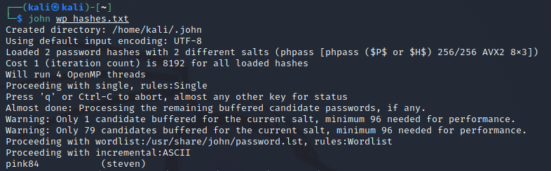
  - Excessively permissible directory permissions. These are public RWX:
    + `/var/www`
    + `/var/www/html`
    + `/var/www/html/vendor`
    + `/var/www/html/wordpress`
    + `/var/www/html/wordpress/wp-admin`
    + `/var/www/html/wordpress/wp-content`
    + `/var/www/html/wordpress/wp-includes`

  - `/var/www/html/wordpress/wp-config` is world readable. The wordpress DB credentials are here!
  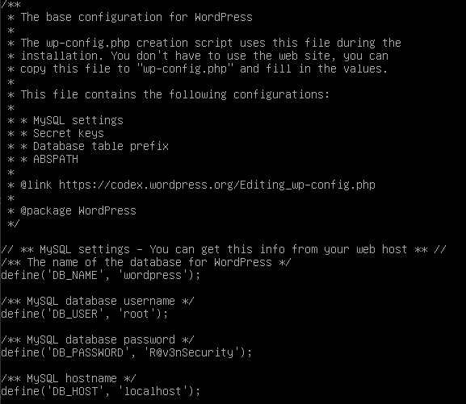
  - connected to wordpress DB and dumped user hashes
  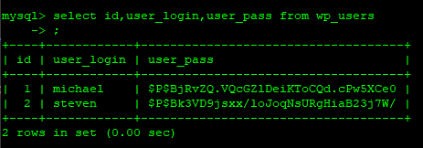
  - XMLRPC exposed on wordpress server. Able to brute force steven's password 
  `wpscan --url http://192.168.1.110/wordpress/wp-login.php  -U steven -P /usr/share/wordlists/rockyou.txt`
  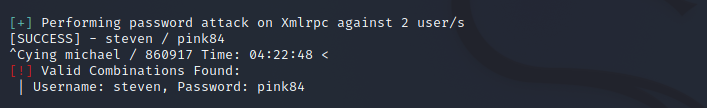

- Target 2
  - As with Traget 1, there are numerous publicly readable directories on the webserver side. XMLRPC is also exposed letting us enumerate users.
  Brute forcing with `wpscan` timed out eventually so either rate limiting was employed or we toppled over the server and did a DoS. :)
  - Through the contact form, we were able to upload a PHP backdoor that let us execute system commands.
  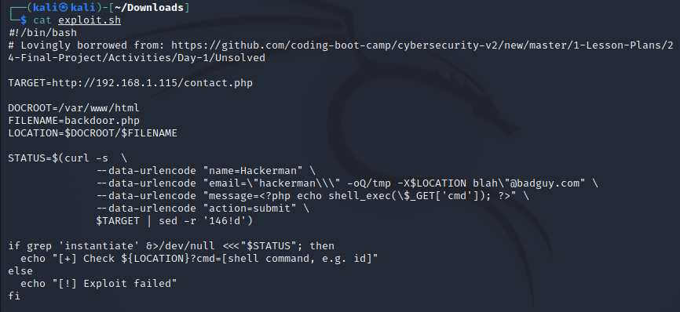
  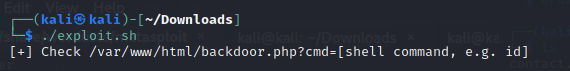
  - Netcat `nc` is installed on the webserver. With the PHP backdoor, we were able to start a reverse shell back to our Kali machine.
    If `nc` is really needed, a version that does not support the `-c` or `-e` options is strongly recommended.
    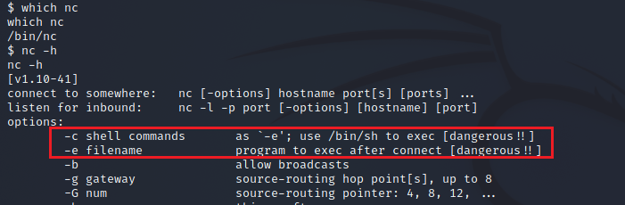
    
    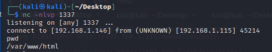
    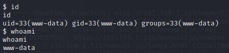
  - Pulled WP database credentials from `wp-config.php` (also reused from Target 1). Connected to wordpress database and pulled hashes for 
    users `michael` and `steven`. User `steven`'s password was cracked offline with the help of `hashcat`. Hashcat was not able to break `michael`'s password hash.
    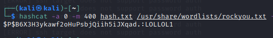
### Exploitation of Targets

The Red Team was able to penetrate `Target 1` and retrieve the following confidential data:
- Target 1
  - `flag1.txt`:  `flag1{b9bbcb33e11b80be759c4e844862482d}`
    - **Exploit Used**
      - embedded as comment in the `service.html` file.
      - view source in the browser
    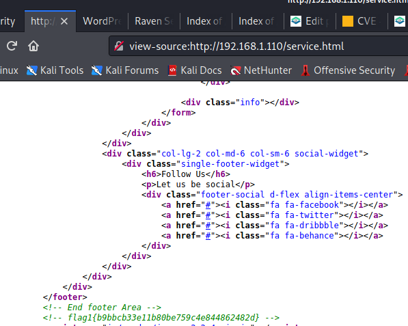  
  - `flag2.txt`:  `flag2{fc3fd58dcdad9ab23faca6e9a36e581c}`
    - **Exploit Used**
      - User enumeration and weak password
      - `ssh michael@192.168.1.110` and `cat flag2.txt` in `/var/www`
    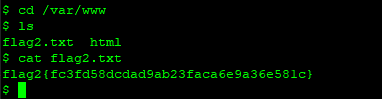  
  - `flag3.txt`: `flag3{afc01ab56b50591e7dccf93122770cd2}`
    - **Exploit Used**
      - Hardcoded DB credentials in `wp-config.php`
      - Use mysql to connect to the wordpress DB and exmaine the wp_posts table. `mysql> select * from wp_posts;`
      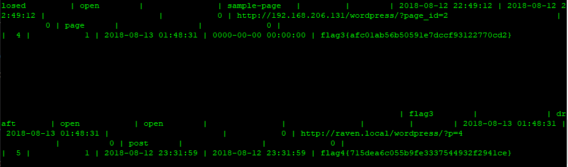
  - `flag4.txt`: `flag4{715dea6c055b9fe3337544932f2941ce}`
    - **Exploit Used**
      1. Like with `flag3`, it is in the `wp_posts` table.
      2. Login (or su) as steven (weak password was cracked/brute forced) 
         Questionable sudoers privileges. User steven can run `python` as `root`.  Spawn a shell and `cat flag4.txt` in `/root`.
     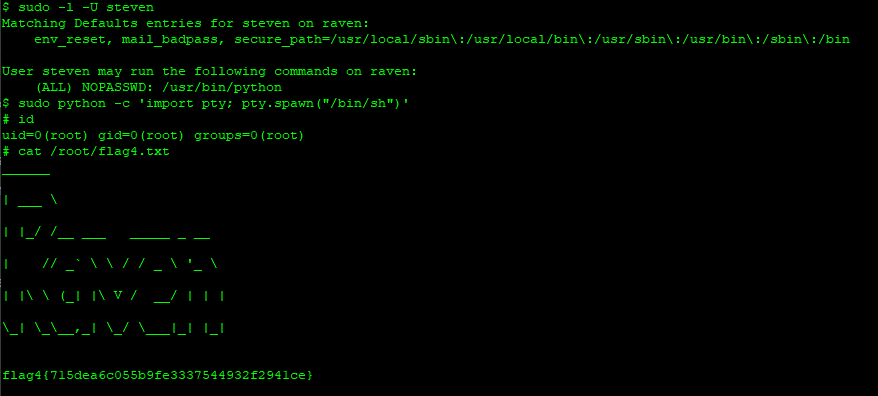    

The Red Team was able to penetrate `Target 2` and retrieve the following confidential data:
- Target 2         
  - `flag1.txt`:  `flag1{a2c1f66d2b8051bd3a5874b5b6e43e21}`
    - **Exploit Used**
      - `/var/www/html/vendor/` is world readable and file `PATH` contained the flag. Can display with browser or `cat PATH` after obtaining a reverse shell.
     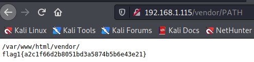
     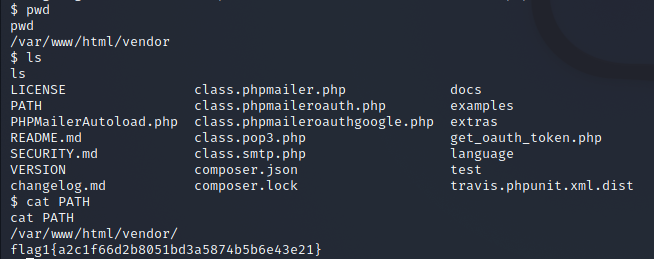  
  - `flag2.txt`:  `flag2{6a8ed560f0b5358ecf844108048eb337}`
    - **Exploit Used**
      - After obtaining reverse shell, `cat /var/www/flag2.txt`
      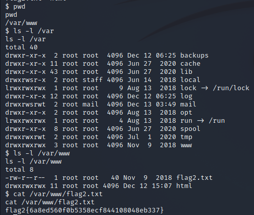
  - `flag3.txt`:  	
    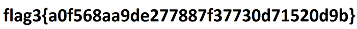
	  - **Exploit Used**
      1. `/wordpress/wp-content/uploads` is world readable. Traverse the links to `2018/11/flag3.png`
      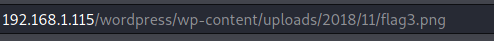
      2. With reverse shell and WP DB creds from `wp-config.php`  `select * from wp_posts;` and the location of the flag is in one of the posts:
      ` http://raven.local/wordpress/wp-content/uploads/2018/11/flag3.png`
      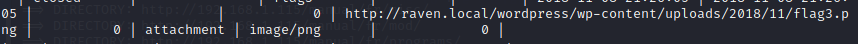	