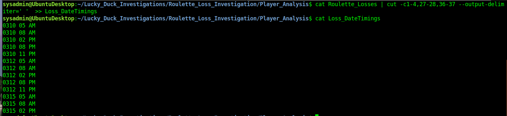
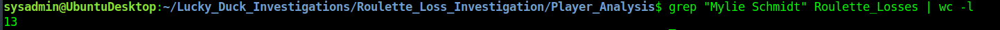
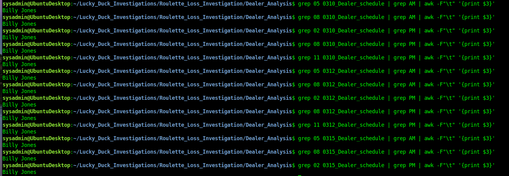
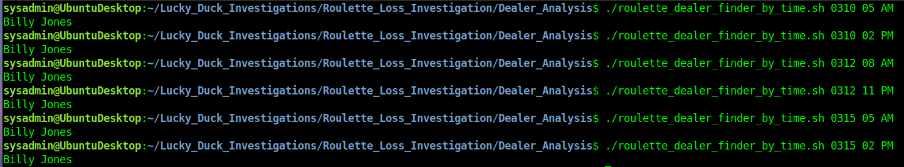
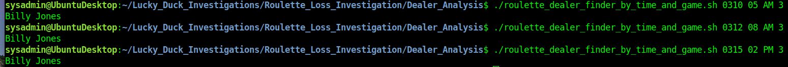

# Andrei Matetic Player_Dealer_Correlation

## Correlating the Evidence  

Use grep to isolate all of the losses that occurred on March 10, 12, and 15th, and place those results in a file called Roulette_Losses.

\# some of the lines have 8 spaces (instead of a tab) between columns 2 & 3   
`grep \- 031*_win_loss_player_data | sed s/'        '/'\t'/g >> Roulette_Losses`  


Preview the file Roulette_Losses and analyze the data and record:

- The times the losses occurred on each day.<br/>
`cat Roulette_Losses | cut -c1-4,27-28,36-37 --output-delimiter=' '  >> Loss_DateTimings `  


- If there is a certain player that was playing during each of those times.
\# Pull out the players during the loses. Cleanup extraneous spaces

`awk -F'\t' '{print($3)}' Roulette_Losses | sed -e s/',[ ]*'/','/g -e s/'[ ]*$'//g -e s/'[ ]*,'/','/g >> Roulette_Losses_thePlayers`
```
Amirah Schneider,Nola Portillo,Mylie Schmidt,Suhayb Maguire,Millicent Betts,Avi Graves
Chanelle Tapia,Shelley Dodson,Valentino Smith,Mylie Schmidt
Jaden Clarkson,Kaidan Sheridan,Mylie Schmidt
Mylie Schmidt,Trixie Velasquez,Jerome Klein,Rahma Buckley
Mcfadden Wasim,Norman Cooper,Mylie Schmidt
Montana Kirk,Alysia Goodman,Halima Little,Etienne Brady,Mylie Schmidt
Rimsha Gardiner,Fern Cleveland,Mylie Schmidt,Kobe Higgins
Mae Hail,Mylie Schmidt,Ayden Beil
Tallulah Rawlings,Josie Dawe,Mylie Schmidt,Hakim Stott,Esther Callaghan,Ciaron Villanueva
Vlad Hatfield,Kerys Frazier,Mya Butler,Mylie Schmidt,Lex Oakley,Elin Wormald
Arjan Guzman,Sommer Mann,Mylie Schmidt
Lilianna Devlin,Brendan Lester,Mylie Schmidt,Blade Robertson,Derrick Schroeder
Mylie Schmidt,Corey Huffman
```
do some frequency analysis</br>
okay, *overkill* in this case but my CDO wouldn't rest. **Mylie Schmidt** stuck out visually, but I was compelled to prove it. :)

`awk -F, -f players.awk Roulette_Losses_thePlayers | sort -t":" -k 2nr`  
> players.awk uploaded to github as part of as part of assignment


- The total count of times this player was playing.
` Mylie Schmidt: 13`
Alternatively with `grep` & `wc`  


## Dealer working during losses  
Missed that the instructions wanted these *scripted*. I manually grepped based on the `Loss_DateTimings`.  **Billy Jones** was the dealer in all these loses.
```
0310 05 AM
0310 08 AM
0310 02 PM
0310 08 PM
0310 11 PM
0312 05 AM
0312 08 AM
0312 02 PM
0312 08 PM
0312 11 PM
0315 05 AM
0315 08 AM
0315 02 PM
```
  

## Scripting Your Tasks
 1. Develop a shell script called `roulette_dealer_finder_by_time.sh` that can analyze the employee schedule to easily find the roulette dealer at a specific time.   
>  `roulette_dealer_finder_by_time.sh` uploaded to github as part of assignment  

 2. Test your script on the schedules to confirm it outputs the correct dealer at the time specified.  


 **[Bonus]**  
 In case there is future fraud on the other Lucky Duck games, create a shell script called `roulette_dealer_finder_by_time_and_game.sh` that has the three following arguments:  
    - Specific time  
    - Specific date  
    - Casino game being played   
> `roulette_dealer_finder_by_time_and_game.sh` uploaded to github as part of assignment  


