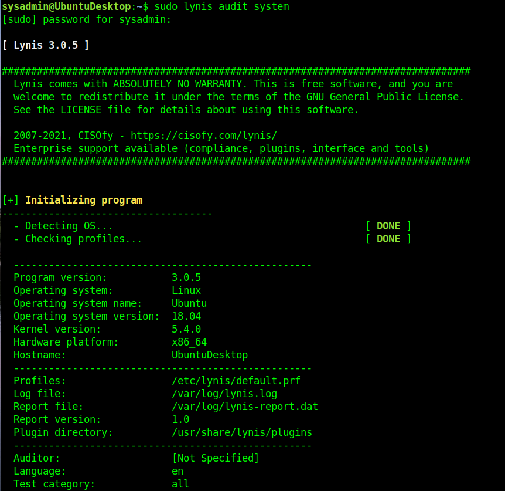
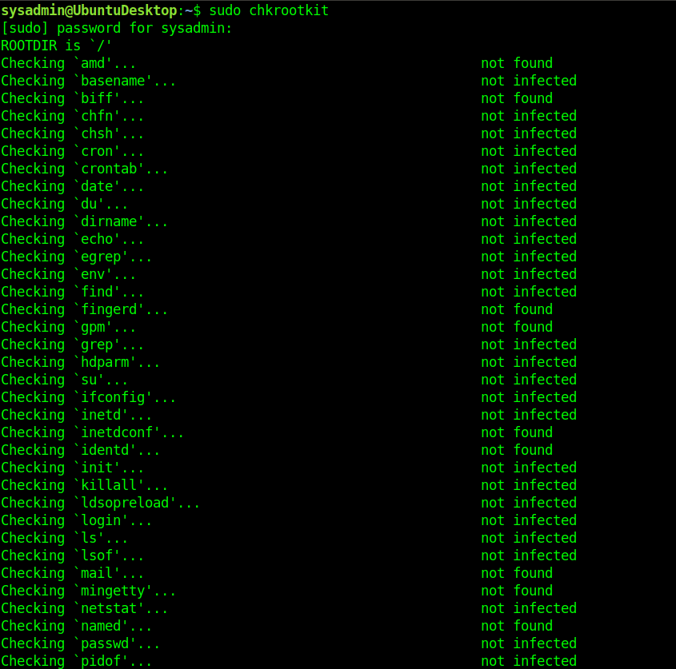

## Week 4 Homework Submission File: Linux Systems Administration

### Step 1: Ensure/Double Check Permissions on Sensitive Files

1. Permissions on `/etc/shadow` should allow only `root` read and write access.

    - Command to inspect permissions:  ` ls -l /etc/shadow`      
 `    -rw-r----- 1 root shadow 2880 Jul  8 18:16 /etc/shadow `    
    group shadow has read permission

    - Command to set permissions (if needed):  ` sudo chmod g-r /etc/shadow `  
   ```
    [sudo] password for sysadmin:  
    ls -l /etc/shadow  
    -rw------- 1 root shadow 2880 Jul  8 18:16 /etc/shadow
    ```

2. Permissions on `/etc/gshadow` should allow only `root` read and write access.

    - Command to inspect permissions: ` ls -l /etc/gshadow `    
    ` -rw-r----- 1 root shadow 1076 May 14 15:31 /etc/gshadow `
group shadow has read permission

    - Command to set permissions (if needed): ` sudo chmod g-r /etc/gshadow `      
  ```
    ls -l /etc/shadow
    -rw------- 1 root shadow 2880 Jul  8 18:16 /etc/shadow
  ```

3. Permissions on `/etc/group` should allow `root` read and write access, and allow everyone else read access only.

    - Command to inspect permissions: `ls -l /etc/group`  
    `-rw-r--r-- 1 root root 1311 Jun 16 20:49 /etc/group`

    - Command to set permissions (if needed): **No changes needed**

4. Permissions on `/etc/passwd` should allow `root` read and write access, and allow everyone else read access only.

    - Command to inspect permissions: `ls -l /etc/passwd`   
    `-rw-r--r-- 1 root root 1311 Jun 16 20:49 /etc/passwd`


    - Command to set permissions (if needed): **No changes needed**

### Step 2: Create User Accounts

1. Add user accounts for `sam`, `joe`, `amy`, `sara`, and `admin`.

    - Command to add each user account (include all five users):  
```    
sudo adduser sam
sudo adduser joe
sudo adduser amy
sudo adduser sara
sudo adduser admin
```

2. Ensure that only the `admin` has general sudo access.

    - Command to add `admin` to the `sudo` group: ` sudo usermod -aG sudo admin `    
```
grep sudo /etc/group
sudo:x:27:sysadmin,instructor,student,jack,admin
```

### Step 3: Create User Group and Collaborative Folder

1. Add an `engineers` group to the system.

    - Command to add group: `sudo addgroup engineers`
```
Adding group `engineers' (GID 1015) ...
Done.
```

2. Add users `sam`, `joe`, `amy`, and `sara` to the managed group.

    - Command to add users to `engineers` group (include all four users):  
```
sudo usermod -aG engineers sam
sudo usermod -aG engineers joe
sudo usermod -aG engineers amy
sudo usermod -aG engineers sara

grep engineers /etc/group
engineers:x:1015:sam,joe,amy,sara
```

3. Create a shared folder for this group at `/home/engineers`.

    - Command to create the shared folder:  `sudo mkdir /home/engineers`  
 ```
 ls -l /home | grep engineers  
 drwxr-xr-x  2 root       root       4096 Jul 10 19:03 engineers
```

4. Change ownership on the new engineers' shared folder to the `engineers` group.

    - Command to change ownership of engineer's shared folder to engineer group:  `sudo chown engineers:engineers /home/engineers/`   
```
ls -l /home/ | grep engineers
drwxr-xr-x  2 engineers    engineers  4096 Jul 10 19:03 engineers
```

### Step 4: Lynis Auditing

1. Command to install Lynis: sysadmin@UbuntuDesktop:~$ ` sudo apt install lynis `  
```
[sudo] password for sysadmin:
Reading package lists... Done
Building dependency tree       
Reading state information... Done
lynis is already the newest version (2.6.2-1).
```  
N.B. I manually upgraded lynis to 3.0.5.

2. Command to see documentation and instructions:  `man lynis`  

3. Command to run an audit: `lynis audit system`  (can run with or without sudo )  

4. Provide a report from the Lynis output on what can be done to harden the system.

    - Screenshot of report output: `uploaded lynis.log to github with this file.`


### Bonus
1. Command to install chkrootkit:  `sudo apt install chkrootkit`   

2. Command to see documentation and instructions: `man chkrootkit`  

3. Command to run expert mode: `sudo chkrootkit -x`

4. Provide a report from the chrootkit output on what can be done to harden the system.
    - Screenshot of end of sample output:  



---
© 2020 Trilogy Education Services, a 2U, Inc. brand. All Rights Reserved.
