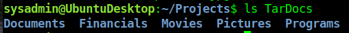
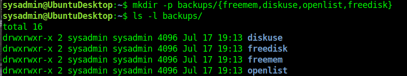
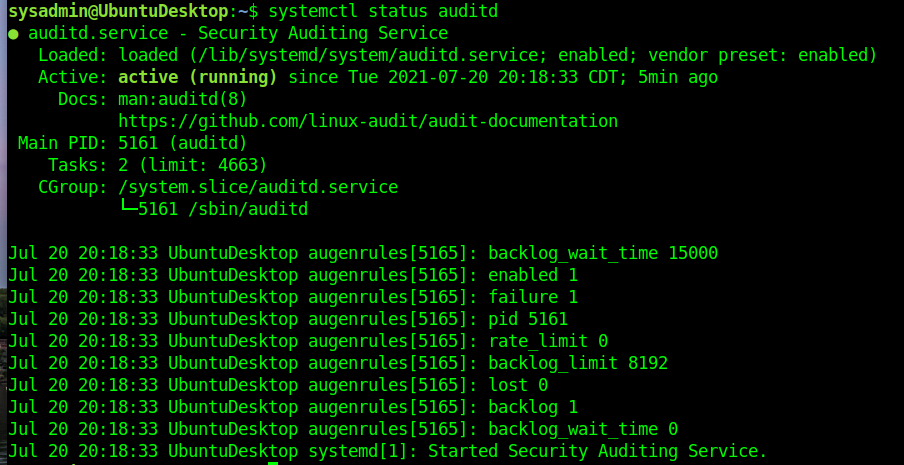
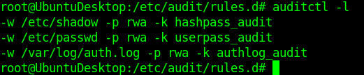
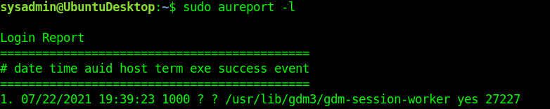
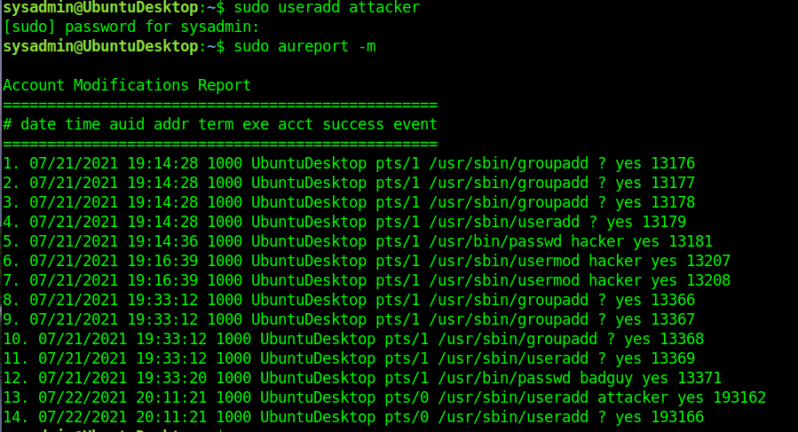
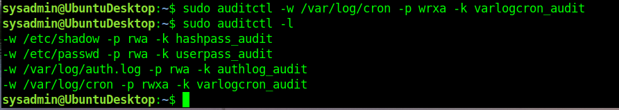
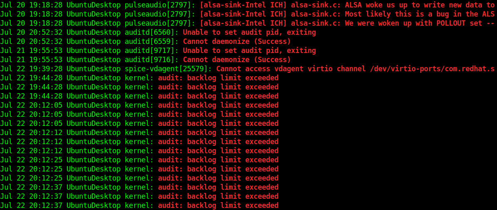

## Week 5 Homework Submission File: Archiving and Logging Data

Please edit this file by adding the solution commands on the line below the prompt.

Save and submit the completed file for your homework submission.

---

### Step 1: Create, Extract, Compress, and Manage tar Backup Archives

1. Command to **extract** the `TarDocs.tar` archive to the current directory:  
    tar xvf TarDocs.tar  



2. Command to **create** the `Javaless_Doc.tar` archive from the `TarDocs/` directory, while excluding the `TarDocs/Documents/Java` directory:  
`tar cvf Javaless_Docs.tar --exclude='TarDocs/Documents/Java' TarDocs`


3. Command to ensure `Java/` is not in the new `Javaless_Docs.tar` archive:  
```  
sysadmin@UbuntuDesktop:~/Projects$ tar tf Javaless_Docs.tar | grep -i java
TarDocs/Programs/NetBeansProjects/HelloWorldApp/src/helloworldapp/HelloWorldApp.java (just an example java source file)
```

**Bonus**
- Command to create an incremental archive called `logs_backup_tar.gz` with only changed files to `snapshot.file` for the `/var/log` directory:  
`sudo tar czvvf logs_backup_tar.gz --listed-incremental=snapshot.file /var/log`

#### Critical Analysis Question

- Why wouldn't you use the options `-x` and `-c` at the same time with `tar`?  

>They do opposite things:  `c` creates an archive and `x` extracts files from an existing one.

---

### Step 2: Create, Manage, and Automate Cron Jobs

1. Cron job for backing up the `/var/log/auth.log` file:  
`sudo crontab -e`  to edit root crontab

 `0 6 * * 3  tar czvvf /auth_backup.tgz /var/log/auth.log >/dev/null 2>&1`
---

### Step 3: Write Basic Bash Scripts

1. Brace expansion command to create the four subdirectories:  
`mkdir -p backups/{freemem,diskuse,openlist,freedisk}`
> `-p` creates parent directories if needed  



2. Paste your `system.sh` script edits below:

    ```bash
    #!/bin/bash
    # Free memory output to a free_mem.txt file
    free -ht > ~/backups/freemem/free_mem.txt

    # Disk usage output to a disk_usage.txt file
    # -h human readable '-d 1' depth 1
    # --exclude= ... they're virtual so no sense in listing
    du -h --exclude={proc,dev,sys} / -d 1 > ~/backups/diskuse/disk_usage.txt

    # List open files to a open_list.txt file
    lsof > ~/backups/openlist/open_list.txt

    # Free disk space to a free_disk.txt file
    df -h > ~/backups/freedisk/free_disk.txt
    ```

3. Command to make the `system.sh` script executable:  
`chmod +x system.sh`

**Optional**
- Commands to test the script and confirm its execution:  

```
sysadmin@UbuntuDesktop:~$ sudo ./system.sh
[sudo] password for sysadmin:
du: cannot access '/run/user/1000/gvfs': Permission denied
lsof: WARNING: can't stat() fuse.gvfsd-fuse file system /run/user/1000/gvfs
      Output information may be incomplete.

sysadmin@UbuntuDesktop:~$ ls -lR backups/  
backups/:  
total 16  
drwxrwxr-x 2 sysadmin sysadmin 4096 Jul 17 21:47 diskuse  
drwxrwxr-x 2 sysadmin sysadmin 4096 Jul 17 20:35 freedisk  
drwxrwxr-x 2 sysadmin sysadmin 4096 Jul 17 20:34 freemem  
drwxrwxr-x 2 sysadmin sysadmin 4096 Jul 17 20:34 openlist  

backups/diskuse:  
total 4  
-rw-r--r-- 1 root root 309 Jul 17 22:11 disk_usage.txt

backups/freedisk:  
total 4  
-rw-rw-r-- 1 sysadmin sysadmin 2109 Jul 17 22:11 free_disk.txt

backups/freemem:
total 4
-rw-rw-r-- 1 sysadmin sysadmin 248 Jul 17 22:11 free_mem.txt  

backups/openlist:  
total 24452  
-rw-rw-r-- 1 sysadmin sysadmin 25038107 Jul 17 22:11 open_list.txt  
```
Resultant text files uploaded to github.

**Bonus**
- Command to copy `system` to system-wide cron directory:  
`sudo cp system.sh /etc/cron.weekly/`
---

### Step 4. Manage Log File Sizes

1. Run `sudo nano /etc/logrotate.conf` to edit the `logrotate` configuration file.

    Configure a log rotation scheme that backs up authentication messages to the `/var/log/auth.log`.

    - Add your config file edits below:

    ```bash
    /var/log/auth.log
    {
      weekly
      rotate 7
      delaycompress    # uncommented compress from `/etc/logrotate.conf`
      notifempty
      missingok
    }

    ```
---

### Bonus: Check for Policy and File Violations

1. Command to verify `auditd` is active: `systemctl status auditd`  


2. Command to set number of retained logs and maximum log file size:

    - Add the edits made to the configuration file below:

    ```bash
    max_log_file = 35
    num_logs = 7
    ```

3. Command using `auditd` to set rules for `/etc/shadow`, `/etc/passwd` and `/var/log/auth.log`:  


    - Add the edits made to the `rules` file below:  

    ```bash
    -w /etc/shadow       -p wra -k hashpass_audit  
    -w /etc/passwd       -p wra -k userpass_audit  
    -w /var/log/auth.log -p wra -k authlog_audit
    ```


4. Command to restart `auditd`: `sudo systemctl restart auditd`

5. Command to list all `auditd` rules: `sudo auditctl -l`


6. Command to produce an audit report: `sudo aureport <parm>`  



7. Create a user with `sudo useradd attacker` and produce an audit report that lists account modifications:  

8. Command to use `auditdctl` to watch `/var/log/cron`:  
`sudo auditctl -w /var/log/cron -p wrxa -k varlogcron_audit`

9. Perform a listing that reveals changes to the `auditd` rules took affect:  

---

### Bonus (Research Activity): Perform Various Log Filtering Techniques

1. Command to return `journalctl` messages with priorities from emergency to error:  
`journalctl -p emerg..err`
> N.B. I added -e to list the most recent (i.e. end) entries  



2. Command to check the disk usage of the system journal unit since the most recent boot:  

`sudo journalctl -b 0 | wc -c`  
254165272 ... approximately 254M

3. Command to remove all archived journal files except the most recent two:  
`sudo journalctl --vacuum-files=2`


4. Command to filter all log messages with priority levels between zero and two, and save output to `/home/sysadmin/Priority_High.txt`:  

`journalctl -p 0..2 >> /home/sysadmin/Priority_High.txt`

5. Command to automate the last command in a daily cronjob. Add the edits made to the crontab file below:
`crontab -e` for the `sysadmin` crontab
    ```bash
    @daily    journalctl -p 0..2 >> /home/sysadmin/Priority_High.txt
    ```

---
© 2020 Trilogy Education Services, a 2U, Inc. brand. All Rights Reserved.
