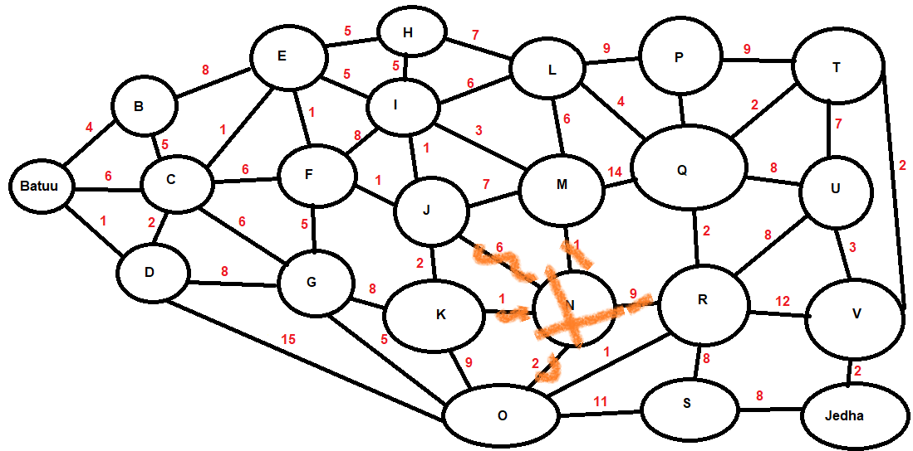
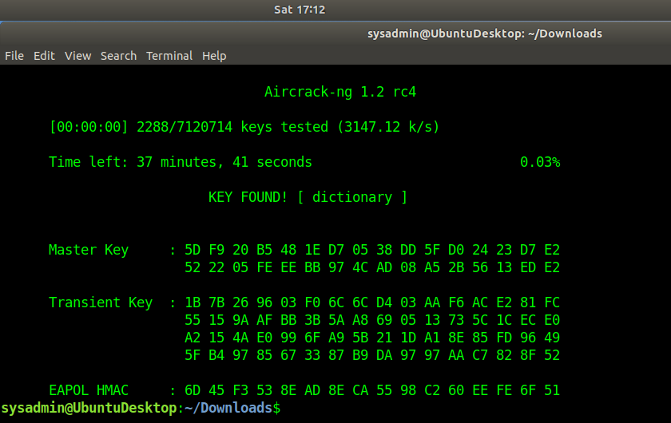

# Networks Fundamentals II Homework: In a Network Far, Far Away!

## Mission 1

**Issue:** Due to the DoS attack, the Empire took down the Resistance's DNS and primary email servers.

The Resistance's network team was able to build and deploy a new DNS server and mail server.
The new primary mail server is `asltx.l.google.com` and the secondary should be `asltx.2.google.com`.
The Resistance (`starwars.com`) is able to send emails but unable to receive any.

Your mission:

* Determine and document the mail servers for `starwars.com` using NSLOOKUP.

```bash
sysadmin@UbuntuDesktop:~$ nslookup -type=mx starwars.com
Server:		8.8.8.8
Address:	8.8.8.8#53

Non-authoritative answer:
starwars.com	mail exchanger = 1 aspmx.l.google.com.
starwars.com	mail exchanger = 10 aspmx2.googlemail.com.
starwars.com	mail exchanger = 10 aspmx3.googlemail.com.
starwars.com	mail exchanger = 5 alt1.aspx.l.google.com.
starwars.com	mail exchanger = 5 alt2.aspmx.l.google.com.
```

* Explain why the Resistance isn't receiving any emails.  
The new servers `asltx.l.google.com` and `asltx.2.google.com` are not defined as mail servers for the domain (i.e. there are no MX records).

* Document what a corrected DNS record should be.  

Replace the above listed mail servers with:  
```bash
starwars.com.   IN  MX  10  asltx.l.google.com.
starwars.com.   IN  MX  20  asltx.2.google.com.
```
> In setting the mail server priorities, I assumed these entries are replacing all of the previous five. Using 10 & 20 for priority there's enough room to add other servers as warranted.
## Mission 2

**Issue:** Now that you've addressed the mail servers, all emails are coming through. However, users are still reporting that they haven't received mail from the `theforce.net` alert bulletins.

Many of the alert bulletins are being blocked or going into spam folders. This is probably due to the fact that `theforce.net` changed the IP address of their mail server to `45.23.176.21` while your network was down. These alerts are critical to identify pending attacks from the Empire.

Your mission:

* Determine and document the `SPF` for `theforce.net` using NSLOOKUP.   
```bash
sysadmin@UbuntuDesktop:~$ nslookup -type=any theforce.net | grep spf
theforce.net	text = "v=spf1 a mx mx:smtp.secureserver.net include:aspmx.googlemail.com ip4:104.156.250.80 ip4:45.63.15.159 ip4:45.63.4.215"
```

* Explain why the Force's emails are going to spam.  
The SPF record text specifies who can send mail on behalf of the domain. The new server IP address is not in the list.

* Document what a corrected DNS record should be.  
The old entry needs to be replaced with `ip4:45.23.176.21` so mail from the new server will be seen as *legitimate*.
## Mission 3

**Issue:** You have successfully resolved all email issues and the resistance can now receive alert bulletins. However, the Resistance is unable to easily read the details of alert bulletins online. They are supposed to be automatically redirected from their sub page of `resistance.theforce.net`  to `theforce.net`.

Your mission:

* Document how a CNAME should look by viewing the CNAME of `www.theforce.net` using NSLOOKUP.

* Explain why the sub page of `resistance.theforce.net` isn't redirecting to theforce.net.

* Document what a corrected DNS record should be.

## Mission 4

**Issue:** During the attack, it was determined that the Empire also took down the primary DNS server of `princessleia.site`.

Fortunately, the DNS server for `princessleia.site` is backed up and functioning.
However, the Resistance was unable to access this important site during the attacks and now they need you to prevent this from happening again. The Resistance's networking team provided you with a backup DNS server of: `ns2.galaxybackup.com`.

Your mission:

* Confirm the DNS records for `princessleia.site`.
```bash
sysadmin@UbuntuDesktop:~$ nslookup -type=ns princessleia.site
Server:		8.8.8.8
Address:	8.8.8.8#53

Non-authoritative answer:
princessleia.site	nameserver = ns25.domaincontrol.com.
princessleia.site	nameserver = ns26.domaincontrol.com.
```
* Document how you would fix the DNS record to prevent this issue from happening again.

## Mission 5

**Issue:** The network traffic from the planet of Batuu to the planet of Jedha is very slow.

You have been provided a network map with a list of planets connected between Batuu and Jedha. It has been determined that the slowness is due to the Empire attacking Planet N.

Your Mission:

* View the Galaxy Network Map and determine the OSPF shortest path from Batuu to Jedha.



* Confirm your path doesn't include Planet N in its route.

* Document this shortest path so it can be used by the Resistance to develop a static route to improve the traffic.

## Mission 6

**Issue:** Due to all these attacks, the Resistance is determined to seek revenge for the damage the Empire has caused.

You are tasked with gathering secret information from the Dark Side network servers that can be used to launch network attacks against the Empire.
You have captured some of the Dark Side's encrypted wireless internet traffic in the following pcap: Darkside.pcap.

Your Mission:

* Figure out the Dark Side's secret wireless key by using Aircrack-ng. Hint: This is a more challenging encrypted wireless traffic using WPA. In order to decrypt, you will need to use a wordlist (-w) such as rockyou.txt.

`aircrack-ng Darkside.pcap -w /usr/share/wordlists/rockyou.txt`



Use the Dark Side's key to decrypt the wireless traffic in Wireshark. Hint: The format for they key to decrypt wireless is `<Wireless_key>:<SSID>`.
`dictionary:linksys`  

Once you have decrypted the traffic, figure out the following Dark Side information:

* Host IP Addresses and MAC Addresses by looking at the decrypted ARP traffic.

Document these IP and MAC Addresses, as the resistance will use these IP addresses to launch a retaliatory attack.

```
00:13:ce:55:98:ef   172.16.0.101
00:0f:66:e3:e4:01   172.16.0.1
```  

## Mission 7

As a thank you for saving the galaxy, the Resistance wants to send you a secret message!
Your Mission:

* View the DNS record from Mission #4.
* The Resistance provided you with a hidden message in the TXT record, with several steps to follow.
* Follow the steps from the TXT record.
**Note:** A backup option is provided in the TXT record (as a website) in case the main telnet site is unavailable Take a screen shot of the results.

`princessleia.site	text = "Run the following in a command line: telnet towel.blinkenlights.nl or as a backup access in a browser: www.asciimation.co.nz"`
